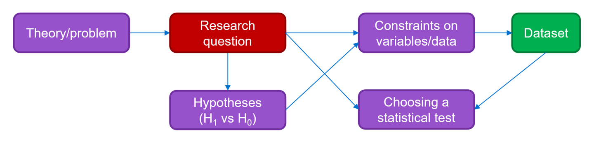
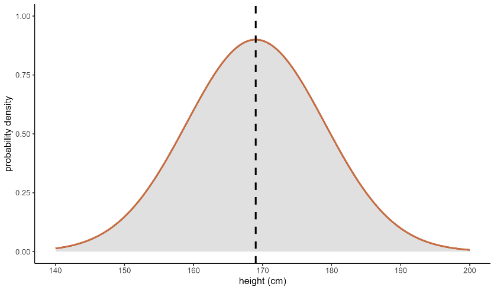

# 'Analyse Your Own Data' - University of Cambridge Statistics Course

***This directory contains all the scripts and data from the above course - attended on the 15th to 19th of April 2024.***

*The notes from the course are contained below in the README.*

# Contents
1. The Research Question
2. Statistical Inference 

## 1. The Research Question

The first step in using statistics to address a research question is defining the question itself. The research question
is key in narrowing the scope of the research and forces a researcher to focus on something specific. After the research
question has been defined, a hypothesis can be formulated and the constraints on the data collection process will become
clearer. The research question, hypothesis, and understanding of the data that will be collected allow a researcher to 
determine the statistical tests that will be needed to analyse the data (as shown in figure 1).

*Figure 1. A flowchart depicting the sequence of events in the framework of statistical inference.*

#### What makes a good research question?

A good research question will focus on a single topic. It should not encompass other topics or be two questions veiled 
as one. A focussed and specific research question will allow you to get much more from your statistics. The question must 
have measurable independent and dependent variables. A research question should also be useful/relevant, 
achievable, based on objective metrics, and free from any assumptions. 

#### What happens if you don't have a research question?

What happens when you have data, but you don't have a specific research question? In this situation, several techniques 
are commonly applied to draw out initial insights which can then be used to generate a research question. The research 
question generated from this exploratory analysis can then be tested (using statistics) to assess whether the results 
are likely to have occurred by chance. These exploratory techniques include things like PCA, data mining, and 
clustering methods. 

## 2. Statistical Inference

Statistical inference is the process of drawing conclusions about a population based on a smaller subset of that 
population known as a sample. A population refers to the complete set of 'things' that you want to know something about. 
For example, if you are looking at human height, then the population would be all humans. However, if you are interested 
in cancer incidence in UK adults over the age of 40, then the population would be all adults in the UK over the age of 40. 
It is typically not feasible to work with the entire population of interest so a smaller sample of the population is 
used. Researchers aim for the sample to be representative of the population as a whole but this can be challenging 
and difficult to assess. As a result, a simplifying framework is used. This framework is known as a probability 
distribution. 

A probability distribution describes the likelihood of an individual from the population having a given value for a 
variable/feature of interest, if that individual was selected at random. The most famous probability distribution is 
the Gaussian distribution, more commonly called a Normal distribution or a Bell Curve, which is shown in figure 2.

  
*Figure 2. A Normal Distribution.*

