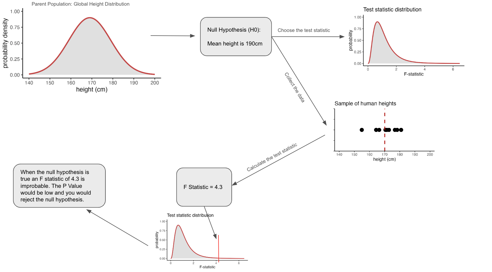

# 'Analyse Your Own Data' - University of Cambridge Statistics Course

***This directory contains all the scripts and data from the above course - attended by Jack Coutts from the 15th to 
the 19th of April 2024.***

*My notes from the course are contained below in the README.*

# Contents
1. The Research Question
2. Statistical Inference 
3. Hypothesis Testing

## 1. The Research Question

The first step in using statistics to address a research question is defining the question itself. The research question
is key in narrowing the scope of the research and forces a researcher to focus on something specific. After the research
question has been defined, a hypothesis can be formulated and the constraints on the data collection process will become
clearer. The research question, hypothesis, and understanding of the data that will be collected allow a researcher to 
determine the statistical tests that will be needed to analyse the data (as shown in figure 1).

*Figure 1. A flowchart depicting the sequence of events in the framework of statistical inference.*

#### What makes a good research question?

A good research question will focus on a single topic. It should not encompass other topics or be two questions veiled 
as one. A focussed and specific research question will allow you to get much more from your statistics. The question must 
have measurable independent and dependent variables. A research question should also be useful/relevant, 
achievable, based on objective metrics, and free from any assumptions. 

#### What happens if you don't have a research question?

What happens when you have data, but you don't have a specific research question? In this situation, several techniques 
are commonly applied to draw out initial insights which can then be used to generate a research question. The research 
question generated from this exploratory analysis can then be tested (using statistics) to assess whether the results 
are likely to have occurred by chance. These exploratory techniques include things like PCA, data mining, and 
clustering methods. 

## 2. Statistical Inference

Statistical inference is the process of drawing conclusions about a population based on a smaller subset of that 
population known as a sample. A population refers to the complete set of 'things' that you want to know something about. 
For example, if you are looking at human height, then the population would be all humans. However, if you are interested 
in cancer incidence in UK adults over the age of 40, then the population would be all adults in the UK over the age of 40. 
It is typically not feasible to work with the entire population of interest so a smaller sample of the population is 
used. Researchers aim for the sample to be representative of the population as a whole but this can be challenging 
and difficult to assess. As a result, a simplifying framework is used. This framework is known as a probability 
distribution. 

A probability distribution describes the likelihood of an individual from the population having a given value for a 
variable/feature of interest, if that individual was selected at random. The most famous probability distribution is 
the Gaussian distribution, more commonly called a Normal distribution or a Bell Curve, which is shown in figure 2. For 
most continuous variables, you can abstract your population to a normal distribution. In simple terms, a distribution 
is supposed to show how things would look if you had your whole population. From your distribution, you can estimate 
the population parameters like the mean, median, and variance. You can generate hypotheses from distributions; for 
example, the mean global height in humans is 169 cm. 

  
*Figure 2. A Normal distribution representing global heights.*

  
*Figure 3. A grid showing distributions other than just a normal distribution.*

**Parameters** and **Statistics** are key terms which can be easy to confuse when working with samples and 
distributions. Parameters refer to values you obtain from a distribution, and statistics refer to values you get from a 
sample (data which is subset of a population). The mean and median statistics from a sample are typically a good 
estimate for their counterpart parameters (the mean and median of the population - which is represented by a distribution).
This is not the case for the variance, the variance statistic is very unlikely to be a good estimate of the variance 
parameter. This is because a sample of a population is highly unlikely to contain the most extreme values; for example, 
when considering global human height you are unlikely to sample the shortest and tallest person. Consequently, a 
different statistic called the sample variance is used instead of variance when estimating the population variance. The 
sample variance (S²) applies a correction to make it a better estimate of the population variance.

Ultimately, statistical inference involves two things:
1. Estimating the population parameters.
2. Testing hypotheses regarding the population parameters. 

Here, a hypothesis refers to an assumption about the shape of the distribution and/or an assumption about a parameter 
value.

## 3. Hypothesis Testing

Hypothesis testing involves asking testable questions that your data can answer.  

#### Classical Hypothesis Testing

1. Determine a population(s) of interest (parent distribution).
2. Formulate a **Null Hypothesis (H₀)** and an **Alternative Hypothesis (H₁)**. These are two opposing assumptions 
about the parent distribution and it's parameters. The null hypothesis is the default assumption that there is no effect 
or no difference in the population. For example, if you are testing a new drug, the null hypothesis might be that the 
drug has no effect on blood pressure compared to a placebo. The alternative hypothesis is what you suspect might be true 
instead of the null hypothesis. In our drug example, the alternative hypothesis could be that the new drug decreases 
patient blood pressure.
3. Collect the data from a sample of the parent distribution. Here the sample distribution is obtained.
4. Select a significance level. This is typically ⍺ = 0.05 which indicates a 5% risk of concluding that a difference 
exists when there is none. This form of incorrect conclusion is known as Type I error.
5. Choose a statistical test and calculate the test statistic. To choose this test, the researchers need an idea of 
what type of distribution the parent distribution is. If the parent distribution type is unknown, a different type of 
test will be selected and these types of tests (known as non-parametric tests) will be discussed later. A statistical 
test will be based on **test statistic**. A test statistic is a value that is calculated to serve as a bridge between 
the data collected in the study and the decisions made based on that data. A test statistic is a single number used to 
summarise the data where it's primary purpose is to measure how far your sample's observed effect deviates from the 
null hypothesis's expected effect. The value of the test statistic reflects the degree of agreement between the sample 
data and the null hypothesis. For any given test/distribution/statistic, the test statistic will follow a theoretical 
distribution and statistical tests will use this distribution to determine the probability of obtaining the observed 
test statistic if the null hypothesis was true. This probability is known as a **p-value**.
6. Interpret the results of the statistical test. Based on the calculated test statistic and p-value, you will either 
reject or fail to reject the null hypothesis. Reject H₀ if p-value < α. Fail to reject H₀ if p-value ≥ α.

In summary, you have a parent distribution, generate a null hypothesis about the parent distribution and it's parameters, 
collect the data, choose a test statistic based on the data and distribution, calculate the statistic for your data, 
assess how probable that statistic is if the null hypothesis is true, and the reject or fail to reject the null 
hypothesis. This process is outlined in figure 4.

  
*Figure 4. Process of classical hypothesis testing - the numbers/graphs are fictional and NOT accurate.*

#### Hypothesis Testing in Practice